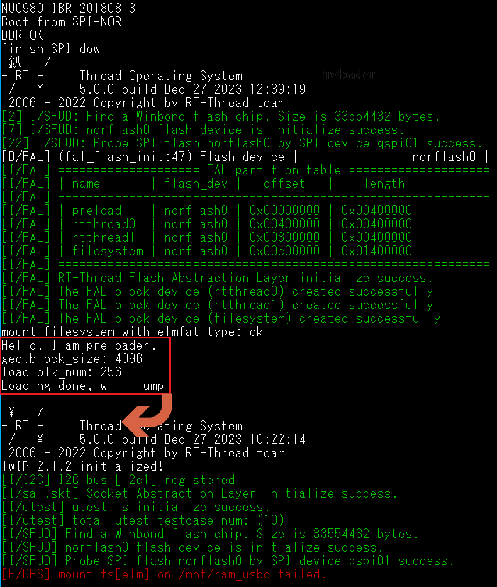

# NUC980-PRELOAD

## Introduction

This is a preloader implementation for load and jump function on NUC980-RTU board(Chili).

<p align="center">

</p>

## Partitions layout of SPI NOR flash

These definitions for this demo are in `<path-to-bsp>/board/fal_cfg.h`.

| Partition Name | Partition Size | Address of Start block | Execution Address |
|--|--|--|--|
| preload    |  4 MB | 0x00000000 | 0x3000000 |
| rtthread0  |  4 MB | 0x00400000 | 0x0000000 |
| rtthread1  |  4 MB | 0x00800000 | 0x0000000 |
| filesystem | 20 MB | 0x00C00000 | 0x3000000 |

## Notice

- Due to the `APP_RO_BASE` definition is pre-defined, so the demo routine is always load-to `APP_RO_BASE` and jump.

- Due to the `APP_SIZE` definition is pre-defined, so the demo routine is always preload 1MB into main-memory from `rtthread0` or `rtthread1` partition.

```c
#define APP_RO_BASE     0x80000000
#define APP_SIZE        (1*1024*1024)
```
